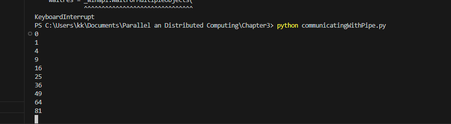
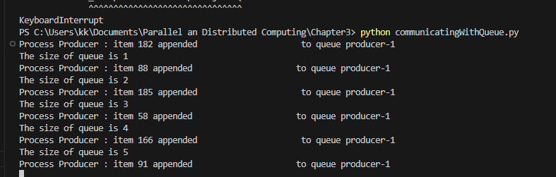
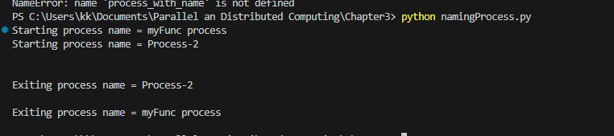
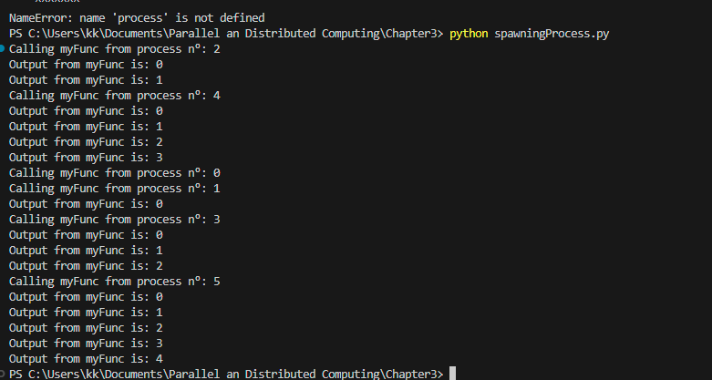

# Chapter 3: Process-Based Parallelism
This chapter explores various concepts and Python implementations related to process management, interprocess communication (IPC), and process synchronization. It covers examples that demonstrate how processes communicate using pipes, queues, and barriers, as well as handling processes in the background, killing processes, and managing process pools.
# Outputs

