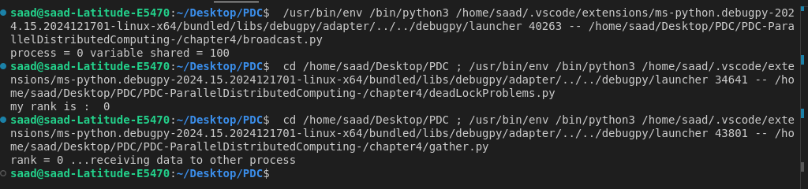
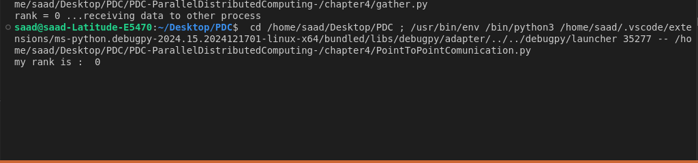

# Chapter 4: Message Passing with mpi4py

This chapter introduces the basics of Message Passing Interface (MPI) in Python using the mpi4py library. It provides practical examples of essential MPI communication methods that enable processes to interact and share data efficiently.

📚 Key Concepts

🔹 Broadcasting

    Share a variable from the root process (rank 0) to all other processes in the system.

🔹 Send/Receive Data

    Demonstrates point-to-point communication by sending and receiving data between two processes.

🔹 Gathering Data

    Collect data from all processes and send it to the root process for further processing.

🔹 Sending Data Between Different Processes

    Explains how to send data between processes by specifying source and destination settings.

🔹 Scattering Data

    Distribute an array from the root process to all other processes, with each process receiving a portion of the data.

⚙️ Requirements

To follow along with this chapter, ensure you have:

    Python Version: Python 3.x
    Library: Install mpi4py via pip:
  
    pip install mpi4py
# Output

